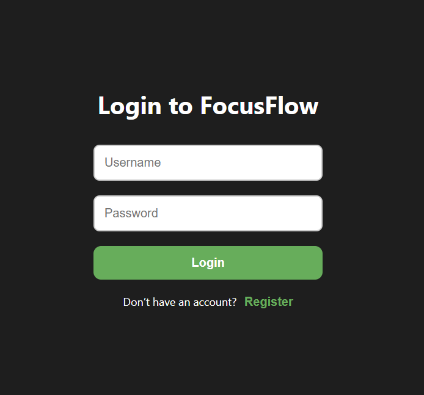
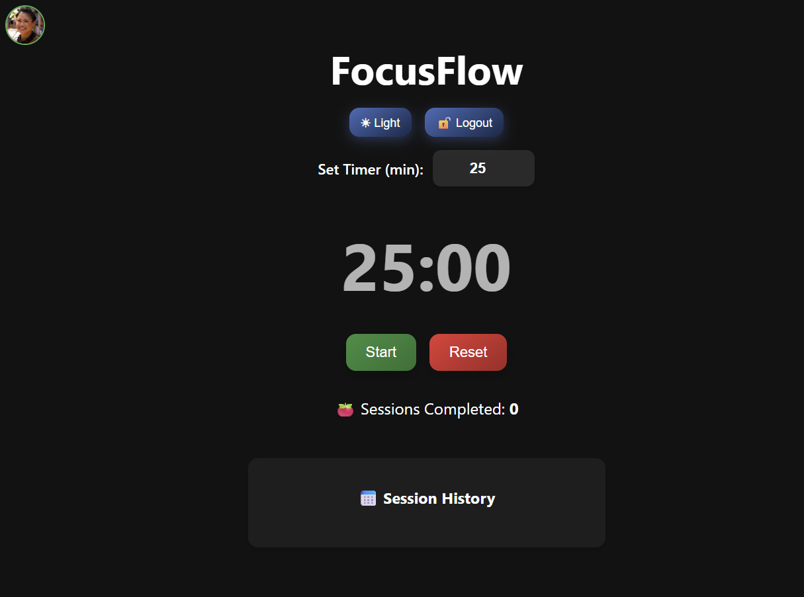
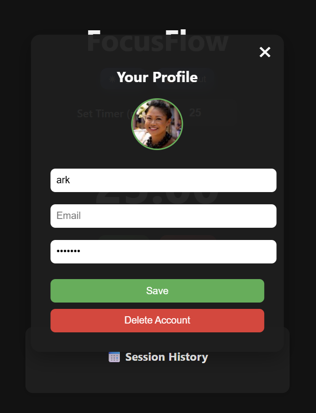

# 🧠 FocusFlow

A beautiful, responsive, and fully functional **Pomodoro Timer Web App** with:

- 🔐 User Registration & Login
- 🕒 Customizable Focus Timer
- 📅 Session History Tracking
- 🧑‍💼 User Profile with Editable Info & Avatar
- 🌗 Dark/Light Mode Toggle
- 💾 Data stored in localStorage (no backend required)

Live Demo 👉 [https://focusflow-flax.vercel.app](https://focusflow-flax.vercel.app)

---

## 📸 Screenshots

| Login Page                        | Timer                             | Profile                               |
|-----------------------------------|-----------------------------------|---------------------------------------|
|  |  |  |

---

## ⚙ Features

- ✅ Register and login with secure credential storage (in localStorage)
- ⏳ Customizable timer duration (1–120 mins)
- ⏸ Start, Pause, and Reset buttons with smooth animations
- 📈 Session history auto-logged with timestamp
- 🧑 Click on profile icon to:
  - Update name, email, password
  - Upload a custom avatar
  - Delete account (with confirmation)
- ☀️ Toggle between Light and Dark mode
- 📱 Fully responsive on mobile/tablet/desktop

---

## 🛠️ Built With

- [React.js](https://reactjs.org/)
- [CSS3](https://developer.mozilla.org/en-US/docs/Web/CSS)
- [Vercel](https://vercel.com/) for deployment
- [localStorage](https://developer.mozilla.org/en-US/docs/Web/API/Window/localStorage)

---

## Setup Locally

1. **Clone the repo**
   ```bash
   git clone https://github.com/Pro5765/focusflow.git
   cd focusflow
2. **Install dependencies**
   npm install
3. **Start the app**
   npm start

---

## Project Structure
focusflow/
│
├── public/
│   └── index.html
├── src/
│   ├── App.js
│   ├── App.css
│   ├── index.js
│   ├── index.css
│   ├── Login.js
│   └── UserProfile.js
├── .gitignore
├── package.json
└── README.md

---

## Author
👤 Ark Barua
📧 [Email](arkbarua16@gmail.com)
🔗 [LinkedIn](www.linkedin.com/in/arkbarua)
💻 [GitHub](https://github.com/Pro5765)

---

## License
This project is open-source and free to use ✌️

---

## Acknowledgments
Thanks to the **Pomodoro Technique** community for the inspiration! 
